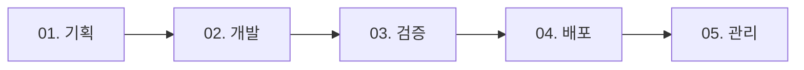

# VIBE CODING GUIDE 2.0

**범용 AI 협업 개발 가이드라인 (Web / Mobile / Hybrid)**

Version: 2.0  
Last Updated: 2025-01-29  
Status: Production Ready

---

## 📖 개요

AI 에이전트(Cursor, Claude Code, Anthropic Claude)와 협업하여 **기획 → 개발 → 검증 → 배포**까지 일관된 품질과 효율을 유지하는 개발 프로세스 가이드입니다.

### 🎯 핵심 원칙

```
1. 명확한 의도 전달 (What, not How)
2. 단계별 검증 (Trust but Verify)
3. 컨텍스트 유지 (Memory & Continuity)
4. 1:1 매핑 (One File = One Responsibility)
5. 보안 우선 (Security by Default)
```

### 🚀 적용 범위

- **Web Application** (React, Next.js, Vue, Svelte, Angular)
- **Mobile Application** (Flutter, React Native, Swift, Kotlin)
- **Hybrid Application** (PWA, Electron, Capacitor)
- **Backend API** (Node.js, Python, Go, Java)

---

## 📑 가이드 구성

### [01. 프로젝트 기획 & 초기 설정](./01_PROJECT_SETUP.md)
- 프로젝트 구조 파악
- Git 저장소 초기화
- 브랜치 전략 수립
- 코드 구조 설계
- 환경 설정

**다음 단계:** [02. 개발](./02_DEVELOPMENT.md)

---

### [02. AI 협업 개발](./02_DEVELOPMENT.md)
- AI 도구별 활용법
- 프롬프트 엔지니어링
- 코드 생성 & 수정
- 실시간 디버깅
- 협업 워크플로우

**이전 단계:** [01. 기획](./01_PROJECT_SETUP.md) | **다음 단계:** [03. 검증](./03_QA_TESTING.md)

---

### [03. 검증 & 테스트](./03_QA_TESTING.md)
- 로컬 테스트
- 성능 최적화
- 크로스 브라우저 테스트
- 보안 검증
- 테스트 자동화

**이전 단계:** [02. 개발](./02_DEVELOPMENT.md) | **다음 단계:** [04. 배포](./04_DEPLOYMENT.md)

---

### [04. 배포](./04_DEPLOYMENT.md)
- 플랫폼별 배포 전략
- 환경 변수 관리
- CI/CD 파이프라인
- 도메인 & SSL 설정
- 배포 체크리스트

**이전 단계:** [03. 검증](./03_QA_TESTING.md) | **다음 단계:** [05. 배포 후 관리](./05_POST_DEPLOYMENT.md)

---

### [05. 배포 후 관리](./05_POST_DEPLOYMENT.md)
- 모니터링 & 알림
- 에러 추적
- 성능 분석
- 롤백 전략
- 비용 최적화

**이전 단계:** [04. 배포](./04_DEPLOYMENT.md)

---

## 🎯 빠른 시작

### 1단계: 프로젝트 확인
```bash
# 파일 구조로 프로젝트 유형 파악
ls -la
```

### 2단계: Git 초기화
```bash
git init
git add .
git commit -m "feat: 프로젝트 초기화"
```

### 3단계: 개발 시작
```bash
# 의존성 설치
npm install  # 또는 pip install -r requirements.txt

# 개발 서버 실행
npm run dev
```

### 4단계: 배포
```bash
# Vercel 예시
vercel --prod
```

---

## 📋 전체 체크리스트

### 기획 단계
```
[ ] 프로젝트 구조 확인
[ ] Git 저장소 초기화
[ ] .gitignore 설정
[ ] 브랜치 전략 수립
[ ] 코드 구조 설계
```

### 개발 단계
```
[ ] AI 도구 설정
[ ] 프롬프트 템플릿 준비
[ ] 1:1 매핑 준수
[ ] 타입 정의
[ ] 에러 처리
```

### 검증 단계
```
[ ] 로컬 테스트
[ ] 성능 측정 (Lighthouse 90+)
[ ] 보안 검증
[ ] 크로스 브라우저 테스트
[ ] 접근성 검사
```

### 배포 단계
```
[ ] 프로덕션 빌드
[ ] 환경 변수 설정
[ ] 배포 실행
[ ] SSL 확인
[ ] 도메인 연결
```

### 배포 후
```
[ ] 1시간 집중 모니터링
[ ] 에러율 확인 (<1%)
[ ] 알림 설정
[ ] 롤백 계획 테스트
```

---

## 🔧 자주 사용하는 명령어

### Git
```bash
git status
git add .
git commit -m "feat: 기능 추가"
git push
```

### NPM
```bash
npm install
npm run dev
npm run build
npm run lint
npm audit
```

### Vercel
```bash
vercel login
vercel          # 프리뷰
vercel --prod   # 프로덕션
```

---

## 📚 추가 자료

### 공식 문서
- [Next.js](https://nextjs.org/docs)
- [React](https://react.dev)
- [TypeScript](https://www.typescriptlang.org/docs)
- [Tailwind CSS](https://tailwindcss.com/docs)

### AI 도구
- [Cursor](https://cursor.sh)
- [Claude](https://claude.ai)
- [GitHub Copilot](https://github.com/features/copilot)

### 보안
- [OWASP Top 10](https://owasp.org/Top10)
- [Web.dev Security](https://web.dev/secure)

---

## 📝 문서 업데이트

이 가이드는 **살아있는 문서**입니다.

### 업데이트 주기
- 분기별 정기 리뷰
- AI 도구 업데이트 시 즉시 반영
- 프로젝트 경험 반영

### 수정 방법
각 MD 파일을 직접 편집하여 팀/개인 환경에 맞게 커스터마이징하세요.

---

**License:** MIT  
**Maintained by:** Vibe Coding Community

---

## 🚦 단계별 진행 가이드



**처음 시작하시나요?** → [01. 프로젝트 기획 & 초기 설정](./01_PROJECT_SETUP.md)  
**이미 개발 중이신가요?** → [02. AI 협업 개발](./02_DEVELOPMENT.md)  
**배포 준비 중이신가요?** → [03. 검증 & 테스트](./03_QA_TESTING.md)

---

*Version 2.0 - 2025-01-29*
